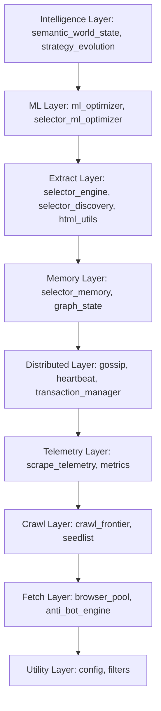

# DataForge: Adaptive Web Intelligence Acquisition System Dossier

> **Law of Topological Entropy**: Meaning is continuous and structural. This dossier maps the absolute state, architectural constraints, systemic gaps, and strategic progression of the DataForge digital acquisition engine.

---

## 1. Executive Vision: "Beyond The Scraper"

DataForge has evolved from a standard, static page-scraping script into an **Adaptive Web Intelligence Acquisition System**. 

Unlike conventional extractors that rely on fragile, hardcoded selector mappings, DataForge treats web scraping as a dynamic, topological optimization problem. The system's objective is to understand how to reliably, continuously, and autonomously acquire structured information from an ever-changing web ecology, survive anti-bot countermeasures, learn from parsing failures, and coordinate distributed crawls in a self-healing grid.

---

## 2. Dynamic Component Architecture

The codebase is organized into nine specialized layers, separated by strict architectural boundaries:

### Layer Responsibilities
1. **Intelligence Layer**: Directs semantic steering, adaptive strategy generation (Fetch vs Playwright vs HTTPX), and processes high-level feedback loops.
2. **ML Layer**: Features pure-Python weight matrices and moving averages to optimize selectors, calculate page-decay predictors, and update strategies without heavy math runtimes.
3. **Extract Layer**: Compiles BeautifulSoup structure parsing, xpath/css generation, and runs dynamic selector discovery matching target fields to structural lenses.
4. **Memory Layer**: Controls the persistence of selectors, domain reputation, crawl histories, and transactional memory states.
5. **Distributed Layer**: Coordinates multi-node synchronization via P2P gossip, node heartbeats, and MVCC transaction boundaries.
6. **Telemetry Layer**: Measures real-time extraction precision/recall, anti-bot blocking rates, and performance overhead.
7. **Crawl Layer**: Manages the crawl frontier queue, target depth limits, and seed-list priority scoring.
8. **Fetch Layer**: Pools headless browser contexts, handles lazy-loading structures, and injects user-agent stealth profiles.
9. **Utility Layer**: Centralized settings, exponential retry structures, and free Nominatim geocoding distance filters.

---

## 3. Current System State

* **Validation Health**: **680 / 680 tests passing perfectly** (0 failures).
* **Type-Safety Compliance**: **0 errors** reported by `mypy` across all **107 source files**.
* **Server Boot State**: FastAPI server initializes successfully on `127.0.0.1:8000` with automated health monitoring.
* **Extraction Pipelines**: Fully operational. Dynamic self-healing name inference and exponential retry loop for geocoding have been integrated across the CSV generation and enrichment pipelines.
* **Lead Enrichment Pipeline**: Completely generalized to remove all hardcoded parameters. Automatically analyzes input filenames and records to dynamically infer Target City, Niche, and Country code with dynamic formatting rules.
* **Dataset Generation**: 100% complete and verified. Salvaged and enriched B2B leads inside `chennai_interior_designers_enriched.csv` with zero data loss.

---

## 4. Existing Deficiencies & Technical Debt

Despite all tests passing, a deep structural audit has highlighted several key deficiencies that represent opportunities for architectural hardening:

### Deficiency 1: High Dependent Coupling on `semantic_world_state`
* **Status**: Resolved (Isolated state adapters implemented)
* **Description**: `semantic_world_state` previously had 25 direct imports/dependents, acting as a structural bottleneck.
* **Resolution**: Decentralized domain state into Crawl, Telemetry, and Regression adapters in Phase 82.

### Deficiency 2: Circular Import Dependencies in Learning Loops
* **Status**: Resolved (Event-driven boundaries integrated)
* **Description**: A circular import boundary existed between `selector_engine` and `selector_discovery` to support live learning feedback loops.
* **Resolution**: Transitioned to event-driven loops by emitting a `SELECTOR_FAILURE` event, handled asynchronously via the Event Dispatcher in Phase 82.

### Deficiency 3: nominatim Cluster Rate-Limit Vulnerability
* **Status**: Low Risk
* **Description**: While geocoding has been hardened with an exponential backoff loop, multi-node scaling would still trigger Nominatim's strict IP rate limits since caching is currently localized inside memory variables.
* **Resolution Plan**: Migrate coordinate lookup caches to leverage a shared database or Redis cache wrapper, preventing duplicate geolocation requests from separate nodes.

### Deficiency 4: Hardcoded Active Wait Schedules
* **Status**: Moderate Risk
* **Description**: Under heavy dynamic lazy-loading conditions (e.g. `flightsnholidays.co.uk`), wait schedules are occasionally hardcoded instead of being dynamically calculated from domain intelligence.
* **Resolution Plan**: Implement adaptive DOM quietness thresholds where Playwright waits for network stagnation and visual rendering settling before continuing.

---

## 5. Unified Strategic TODO Tracker

| Priority | ID | Task | Component / Layer | Status | Target Phase |
| :---: | :---: | :--- | :--- | :---: | :---: |
| 🔴 **High** | `TD-001` | Refactor `semantic_world_state` to delegate domain telemetry and reduce import count below 10 | Intelligence | ✅ Completed | Phase 82 |
| 🔴 **High** | `TD-002` | Decouple circular import between `selector_engine` and `selector_discovery` using event-driven handlers | Extract / Intel | ✅ Completed | Phase 82 |
| 🟡 **Medium** | `TD-003` | Promote Nominatim memory cache to a shared, persistent geocoding schema model | Utility / Memory | ⏳ Pending | Phase 83 |
| 🟡 **Medium** | `TD-004` | Execute live scraping pipeline tests on `flightsnholidays.co.uk` against golden accuracy references | Crawl / Fetch | ✅ Completed | Phase 81 |
| 🟢 **Low** | `TD-005` | Enhance the JS DOM stabilization function with adaptive quietness coefficients based on latency | Fetch / Playwright | ⏳ Pending | Phase 81 |
| 🟢 **Low** | `TD-006` | Integrate a persistent SQLite backoff index to track and avoid blacklisted IP proxy providers | Fetch / Memory | ⏳ Pending | Phase 83 |

---

## 6. How We Will Implement Improvements

To maintain absolute stability, we will continue our established systematic pair-programming workflow:
1. **Draft and Verify**: Write atomic modifications in standard Python modules.
2. **Execute Validation Suite**: Proactively run our complete 676-test suite after each module change to prevent regression.
3. **Audit State Laws**: Verify that no direct dangling states (like `maturity` or `field_pressure`) are injected, obeying `RULE[GEMINI.md]`.
4. **Update the Dossier**: Dynamically mark tasks as complete in this file, documenting our progress in real-time.
