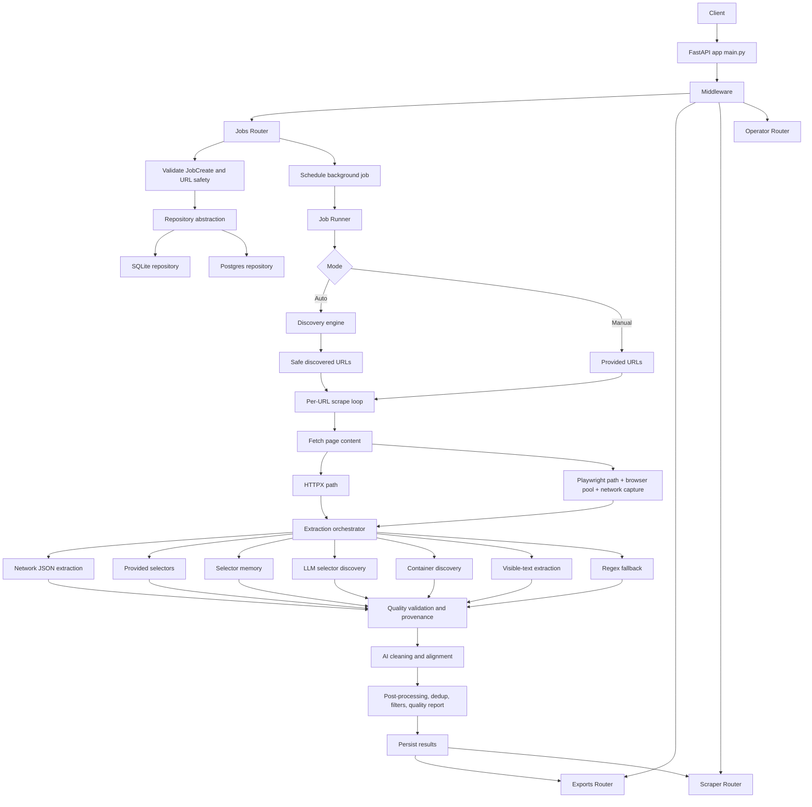

# Rebuild Report for Harshit-sehgal/Scraper

## Executive Summary

Research for this report uses the enabled connector set: **GitHub**. The codebase analyzed is the uploaded snapshot of **Harshit-sehgal/Scraper** only, and the project identifies itself internally as **DataForge Scraper**. The snapshot is a large, ambitious, pre-production FastAPI + Playwright extraction platform with a static dashboard, dual SQLite/Postgres persistence paths, a persistent worker queue, export endpoints, extensive validation scaffolding, and a very large layer of experimental “semantic / topology / adaptive” modules. The strongest safe characterization is: **a serious extraction platform prototype with unusually broad feature surface area, but with a core that is more maintainable than its experimental perimeter and still not cleaned up enough to be a straightforward production service**. (Sources: `README.md`; `PROJECT_STATUS.md`; `docs/ARCHITECTURE.md`; `docs/LIMITATIONS.md`.)

The core product path is coherent. A request enters FastAPI, creates or inspects jobs, persists state through a storage abstraction, schedules background execution, performs optional URL discovery, fetches pages via Playwright or HTTPX, runs a layered extraction cascade, cleans/validates records, and exposes results through APIs and exports. That core path exists today and is reconstructable from the repository with high confidence. The biggest impediments to rebuilding cleanly are not conceptual gaps; they are **scope sprawl, oversized modules, duplicated persistence logic, too many runtime tunables, partial documentation drift, and missing repository hygiene items such as an explicit license and clearer packaging metadata**. (Sources: `backend/app/main.py`; `backend/app/routers/jobs.py`; `backend/app/services/job_runner.py`; `backend/app/scraper.py`; `backend/app/extraction_orchestrator.py`; `backend/app/storage_interface.py`; `backend/app/job_store.py`; `backend/app/postgres_repository.py`.)

The most important findings for a rebuild are these. First, the project’s real value is in the **job lifecycle, extractor cascade, storage abstraction, security boundary, and export path**. Second, the experimental subsystem surface should be **quarantined, not deleted blindly**. Third, the current structure can be rebuilt cleanly as a smaller, layered architecture with stable extension points. Fourth, the repository already contains most of the behaviors needed to define acceptance criteria: health/readiness, job CRUD, discovery, scrape execution, exports, route authorization, environment validation, and optional browser/Postgres/golden-dataset suites. Fifth, the codebase would benefit immediately from a modernization pass using **Ruff, Black or Ruff formatter, mypy, pytest-cov, Bandit, pip-audit, and pre-commit**, plus a formal license and vendored-asset notices. (Sources: `.github/workflows/ci.yml`; `.github/workflows/optional-suites.yml`; `.github/workflows/validate-production.yml`; `docs/CODE_QUALITY.md`; `backend/requirements.txt`; `backend/requirements-dev.txt`.)

I generated full machine-readable inventories from the snapshot to support a true rebuild audit:

| Artifact | Purpose |
| --- | --- |
| [Complete file inventory CSV](sandbox:/mnt/data/scraper_file_inventory.csv) | All 510 files with path, size, line count, language, purpose, detected functions/classes/imports |
| [Complete file inventory JSON](sandbox:/mnt/data/scraper_file_inventory.json) | Same inventory in JSON form |
| [Backend code metrics CSV](sandbox:/mnt/data/scraper_code_metrics.csv) | Per-module LOC and rough complexity metrics for `backend/app` |
| [Test inventory CSV](sandbox:/mnt/data/scraper_test_inventory.csv) | Automated/manual tests and fixtures inventory |

Those generated artifacts are the most exhaustive answer to the “every file” requirement within the practical limits of a chat response. The report below focuses on the highest-signal architecture, module behavior, risk analysis, rebuild specification, and templates you can paste into a new chat and use as a reconstruction blueprint.

## Repository Snapshot and Inventory

The snapshot contains **510 files**, including **353 Python files overall**, with the bulk of the code under `backend/`. The repository is not a simple scraper script; it is a multi-surface application with backend APIs, tests, infra, docs, and frontend assets. This was established by scanning the uploaded ZIP line by line into the generated inventory artifacts linked above.

### Top-level inventory

| Path | Files | Approx. size | Role |
| --- | ---: | ---: | --- |
| `backend/` | 405 | 13.0 MB | Backend application, tests, requirements, benchmarks, DB init |
| `frontend/` | 20 | 856 KB | Static internal dashboard and dashboard vendor assets |
| `docs/` | 34 | 177 KB | Architecture, security, setup, production, testing, status docs |
| `scripts/` | 23 | 129 KB | Startup, smoke, release, validation, backup/restore, load scripts |
| `.github/workflows/` | 7 | 25.6 KB | CI, nightly, browser, Postgres, golden-dataset, production validation |
| `grafana/` | 3 | 4.2 KB | Grafana provisioning |
| Root config files | 18 | small | Docker, Compose, Nginx, Prometheus, env examples, Makefile, README |

### What the file tree says about intent

The repository is organized like a serious service, not a toy scraper. The strongest signals are:

| Signal | Evidence | Interpretation |
| --- | --- | --- |
| FastAPI service boundary | `backend/app/main.py`, `backend/app/routers/*.py` | API-first architecture |
| Browser automation path | `backend/app/browser_pool.py`, `backend/app/html_utils.py`, `backend/app/scraper.py` | Handles JS-heavy pages when needed |
| Storage abstraction | `backend/app/storage_interface.py`, `backend/app/job_store.py`, `backend/app/postgres_repository.py` | Supports local and production persistence strategies |
| Async background execution | `backend/app/services/job_runner.py`, `backend/app/worker_queue.py`, `backend/app/worker_queue_postgres.py` | Jobs can run outside the request path |
| Export contracts | `backend/app/routers/exports.py`, `backend/app/utils/export.py` | Results are intended to be consumed programmatically |
| Security/control surfaces | `backend/app/url_safety.py`, `backend/app/rate_limiter.py`, `backend/app/utils/rbac.py`, `scripts/check_prod_env.py` | Explicitly tries to define a safe deployment boundary |
| Monitoring and ops | `nginx.conf`, `prometheus.yml`, `grafana/`, `scripts/smoke_prod_stack.sh` | Service deployment was clearly anticipated |
| Research perimeter | `semantic_*`, `topology_*`, `gossip_*`, `federation_*`, `chaos_*`, `strategy_*` modules | Experimental subsystem embedded beside production-adjacent code |

### Inventory interpretation

For rebuild purposes, the repository breaks naturally into these bands:

| Band | Files to preserve conceptually | Rebuild stance |
| --- | --- | --- |
| Core application | `main.py`, routers, models, scraper, extraction orchestrator, storage, exports, security, job runner | Rebuild first |
| Operational foundation | scripts, Docker, Compose, Nginx, Prometheus, Grafana, env validation | Rebuild second |
| Test harness | `backend/tests/`, `backend/benchmarks/`, route matrix tooling | Rebuild third, but use to lock behavior |
| Experimental subsystems | semantic/topology/federation/gossip/replay/evolution modules | Keep behind feature flags or separate package |
| Static dashboard | `frontend/` | Keep internal-only until security model is redesigned |
| Documentation | `docs/` | Use selectively; some parts are helpful, some are stale or self-reported |

## Architecture and Runtime Model

At the architectural level, the repository is a layered request-processing and job-processing system with a large experimental extension zone.

### High-confidence architecture

| Layer | Main files | What it does |
| --- | --- | --- |
| API entry | `backend/app/main.py` | Creates FastAPI app, lifecycle hooks, middleware, routers, health/readiness/metrics, static mounts |
| Route layer | `backend/app/routers/jobs.py`, `exports.py`, `scraper.py`, `operator.py`, `experimental.py` | Exposes job lifecycle, exports, telemetry/diagnostics, operator controls, experimental endpoints |
| Domain models | `backend/app/models.py` | Defines `Job`, `JobCreate`, `SchemaField`, filters, status enums, source policies |
| Job orchestration | `backend/app/services/job_runner.py` | Executes one job end-to-end, including discovery, scraping, cleaning, post-processing |
| Fetching | `backend/app/html_utils.py`, `backend/app/browser_pool.py`, `backend/app/browser_network_capture.py` | HTTPX and Playwright fetch paths, browser reuse, capture and browser state |
| Extraction | `backend/app/scraper.py`, `backend/app/extraction_orchestrator.py`, `selector_*`, `container_discovery.py`, `network_extractor.py`, `rendered_visible_text_extractor.py` | Runs extraction cascade and provenance tracking |
| Persistence | `backend/app/storage_interface.py`, `job_store.py`, `postgres_repository.py` | Repository abstraction and backend-specific implementations |
| Queueing | `backend/app/worker_queue.py`, `worker_queue_postgres.py` | Durable background task queue |
| Security and governance | `url_safety.py`, `rate_limiter.py`, `utils/rbac.py`, `utils/prod_security_validator.py`, `audit_logger.py` | Auth, SSRF reduction, rate limiting, logging, production checks |
| Infra and observability | `Dockerfile`, Compose files, `nginx.conf`, Prometheus/Grafana config, ops scripts | Deployment and monitoring scaffolding |

### Execution entry points

| Entry point | Command or file | Purpose |
| --- | --- | --- |
| API server | `uvicorn app.main:app --reload` | Main app for development |
| Production server | `scripts/start_server.sh` | Validates env then starts service |
| Worker | `scripts/run_worker.py`, `scripts/start_worker.sh` | Background queue worker |
| Architecture validator | `architecture_validator.py` | Repository-specific invariants check |
| Production validator | `scripts/check_prod_env.py` | Fails on placeholder production config |
| Route authorization matrix | `scripts/route_auth_matrix.py` | Generates route-auth documentation |
| Smoke and release scripts | `scripts/verify_all.sh`, `verify_release.sh`, `smoke_prod_stack.sh` | Operational validation |

### Data flow



This is not speculative. `main.py` wires the routers and middleware; `jobs.py` builds the jobs router; `job_runner.py` runs the job lifecycle; `scraper.py` delegates to `fetch_page_content()` and `orchestrate_extraction()`; `storage_interface.py` selects storage; `exports.py` exposes result exports. (Sources: `backend/app/main.py` around router inclusion and HTTP endpoints; `backend/app/routers/jobs.py`; `backend/app/services/job_runner.py`; `backend/app/scraper.py`; `backend/app/html_utils.py`; `backend/app/extraction_orchestrator.py`; `backend/app/storage_interface.py`.)

### Runtime requirements

| Requirement | Current evidence | Rebuild guidance |
| --- | --- | --- |
| Python | Dockerfile and workflows use Python 3.12 | Standardize on Python 3.12 |
| Browser runtime | Playwright Chromium installed in Docker and workflows | Treat Chromium as required for JS-heavy sites |
| Default DB | SQLite via repository/store path | Keep as default developer mode |
| Production DB | Postgres via `DATAFORGE_DATABASE_URL` | Keep as production mode |
| Reverse proxy | `nginx.conf` + prod compose | Preserve, but simplify first |
| Metrics | Prometheus + Grafana configs | Keep optional |
| Env management | `.env.example`, `.env.production.example`, `config.py` | Reduce variable surface during rebuild |
| OS libs | Dockerfile installs Chromium runtime libs | Keep in production image |

## File and Module Analysis

A literal 510-row, all-file report is more practical as the generated inventory artifacts than as chat prose. The table below covers the files that matter most to a clean rebuild, followed by grouped analysis for the remaining file families.

### High-value source files

| File | Functionality | Key functions/classes | Inputs and outputs | External dependencies | Risks and likely issues |
| --- | --- | --- | --- | --- | --- |
| `backend/app/main.py` | FastAPI app, middleware, lifespan, health/readiness, metrics, static mounts | `lifespan`, `body_size_middleware`, `api_key_middleware`, `latency_tracking_middleware`, `health`, `ready`, `metrics` | Inputs: HTTP requests, env/config, repositories. Outputs: API responses, metrics text, mounted static frontend | FastAPI, Starlette, Prometheus client, app routers/services | Large file, mixed concerns, auth and docs comments partially drift from actual path handling |
| `backend/app/models.py` | API and job contracts | `SchemaField`, `FilterRule`, `JobCreate`, `Job`, enums | Inputs: API JSON bodies. Outputs: validated in-memory models | Pydantic | Strong foundation, but schema evolution affects many modules |
| `backend/app/config.py` | Centralized settings with very large env surface | `Settings` and dynamic properties | Inputs: env vars and `.env`. Outputs: runtime settings object | pydantic-settings | Too many knobs; config sprawl increases rebuild complexity and documentation drift |
| `backend/app/routers/jobs.py` | Job lifecycle API | `create_jobs_router` and nested route handlers | Inputs: create/cancel/delete/restore requests. Outputs: job metadata and results | FastAPI, services, repository | Router factory is large and complex; some job mutation logic belongs in services |
| `backend/app/routers/exports.py` | Export endpoints | `export_csv`, `export_json`, `export_excel` | Inputs: job ID. Outputs: downloadable export streams/files | pandas/openpyxl utilities | Large exports and memory behavior need limits and streaming review |
| `backend/app/routers/scraper.py` | Telemetry/diagnostics/operator-style scraper insights | many GET/POST handlers | Inputs: diagnostics and telemetry queries. Outputs: system detail JSON | various backend modules | Router exposes many experimental surfaces; should be split into stable vs experimental |
| `backend/app/services/job_runner.py` | Executes a job end-to-end | `run_job` | Inputs: job ID, job store, limits/timeouts. Outputs: persisted job state and results | asyncio + many app modules | Very high complexity; central hot path should be decomposed |
| `backend/app/scraper.py` | Core scraping orchestration | `ScrapeAttemptResult`, `scrape_url_attempt`, `scrape_url` | Inputs: URL, schema fields, selectors, search params. Outputs: list-like result plus metadata | BeautifulSoup, app extraction/fetch/recovery/telemetry modules | Highest-complexity function in snapshot; too many responsibilities and experimental hooks |
| `backend/app/extraction_orchestrator.py` | Multi-layer extraction cascade | `ExtractionResult`, `orchestrate_extraction`, `_multi_pass_extraction` | Inputs: URL, HTML, schema, score threshold. Outputs: extracted records and method metadata | selector memory/discovery, network extractor, container discovery | Another monolith; layered idea is good, implementation needs narrower interfaces |
| `backend/app/html_utils.py` | HTTP/Playwright fetch and HTML helpers | `fetch_page_content`, `_fetch_with_httpx`, contact/noise helpers | Inputs: URL and fetch strategy. Outputs: HTML, delays, method used | HTTPX, Playwright pool, BeautifulSoup | Important SSRF boundary; mixed helper and fetch logic should be split |
| `backend/app/browser_pool.py` | Persistent Chromium and context reuse | `BrowserPool`, `get_context`, `_hard_recycle`, `get_browser_pool` | Inputs: domain and strategy. Outputs: Playwright contexts | Playwright | Useful optimization, but tightly coupled to stealth/proxy concerns |
| `backend/app/storage_interface.py` | Repository abstraction | `JobRepository`, `SQLiteJobRepository` and Postgres selector helpers | Inputs: CRUD-style persistence calls. Outputs: `Job` objects and persisted state | app repository modules | Good seam for rebuild; keep |
| `backend/app/job_store.py` | SQLite-backed persistence | many SQLite helpers | Inputs: `Job` models. Outputs: SQLite rows and loaded jobs | sqlite3 | Large and low-level; duplicates behavior with Postgres implementation |
| `backend/app/postgres_repository.py` | Postgres-backed persistence | `PostgresJobRepository`, connection pool/schema helpers | Inputs: jobs, recycle bin and world state. Outputs: Postgres rows and objects | psycopg2 | Good production direction, but code duplicates SQLite model transforms |
| `backend/app/worker_queue.py` | SQLite durable queue | `WorkerQueue`, `QueueTask`, schema and dequeue logic | Inputs: queue tasks. Outputs: scheduled/dequeued/completed history | sqlite3 | Separate queue DB and custom queue semantics increase maintenance surface |
| `backend/app/worker_queue_postgres.py` | Postgres durable queue | `PostgresWorkerQueue` | Inputs/outputs similar to SQLite queue | psycopg2 | Queue duplication should be reduced via shared abstractions |
| `backend/app/url_safety.py` | SSRF-oriented URL validation | `validate_public_http_url`, `is_safe_ip` | Inputs: URLs. Outputs: allow/reject exceptions | stdlib networking/ipaddress | Strong baseline, but DNS checks are intentionally weaker outside staging/production |
| `backend/app/rate_limiter.py` | API rate limiting | `DatabaseSlidingWindowCounter`, `SlidingWindowCounter`, `RateLimiterMiddleware` | Inputs: request path/client IP. Outputs: 429s and rate-limit headers | FastAPI/Starlette + DB backends | One clear bug: DB error path logs “falling back” but actually returns deny (`False`) |
| `backend/app/utils/rbac.py` | API key role resolution | `UserRole`, `get_current_role`, `require_role` | Inputs: headers. Outputs: role or HTTP 403 | FastAPI, secrets | Dev mode permissive by design; must stay disabled outside dev |
| `backend/app/utils/export.py` | Safe export naming | `safe_export_filename` | Inputs: job names/identifiers. Outputs: sanitized filenames | stdlib | Small and useful |
| `Dockerfile` | Dev/prod container build | multi-stage Dockerfile | Inputs: repo source and requirements. Outputs: dev/prod images | Python 3.12-slim, Playwright | Good baseline, but dependency/build toolchain should be hardened further |
| `docker-compose.prod.yml` | Production-like stack | service definitions | Inputs: env vars and images. Outputs: app/worker/postgres/nginx/monitoring stack | Docker Compose | Useful reference, but too ambitious for first clean rebuild |
| `nginx.conf` | Reverse proxy and public boundary | nginx locations and headers | Inputs: HTTP traffic. Outputs: proxied app, blocked docs/metrics, headers | Nginx | Sensible defaults; keep but simplify during first rebuild |
| `architecture_validator.py` | Custom architectural laws | AST checks and forbidden patterns | Inputs: backend Python source. Outputs: pass/fail | stdlib AST | Interesting, but too bespoke to be a primary quality gate |

### What to do with the rest of `backend/app`

The backend application family can be rebuilt as four buckets.

| Bucket | Example files | Rebuild treatment |
| --- | --- | --- |
| Keep and refine | `main.py`, routers, `models.py`, `config.py`, `scraper.py`, `extraction_orchestrator.py`, `storage_interface.py`, `job_store.py`, `postgres_repository.py`, `html_utils.py`, `browser_pool.py`, `url_safety.py`, `rate_limiter.py`, `utils/*` | Preserve behavior, reduce size, improve typing/tests |
| Keep but isolate | `selector_memory.py`, `strategy_evolution.py`, `selector_decay_predictor.py`, `regression_capture.py`, `browser_network_capture.py`, `session_url_detector.py` | Make clearly optional |
| Quarantine as experimental | `semantic_*`, `topology_*`, `gossip_*`, `federation_*`, `manifold_*`, `intent_*`, `energy_*`, `motif_*`, `chaos_*`, `insight_engine.py` where speculative, and similar research modules | Move behind feature flag, separate package, or `experimental/` namespace |
| Revisit for deletion or major split | very large “state” and “semantic” monoliths, duplicate queue/repository implementations | Keep only if a specific feature proves necessary |

### Tests, docs, fixtures, and frontend

The repository contains an unusually large test surface: more than 170 Python test files plus HTML/JSON fixtures. The tests are a strength, but not all are equally valuable to a rebuild.

| Family | Value in rebuild |
| --- | --- |
| Core API/job/storage/security tests | Highest value; use as migration safety net |
| Browser, Postgres, golden dataset tests | Important for optional capability tiers |
| Manual tests | Useful as human runbooks, not as CI |
| Research/semantic tests | Keep only if the corresponding feature survives the scope cut |
| HTML fixtures | Valuable for deterministic extraction tests |
| Frontend dashboard files | Keep internal-only, decouple from backend security assumptions |
| Docs | Use as design commentary, not as ground truth unless code agrees |

## Ideology, Outputs, Testing, and Success Criteria

### Project ideology and intent

The project’s internal ideology is unusually explicit. It wants to be **capable, configurable, and operationally serious**, but it also repeatedly warns against overclaiming. The README, project status, limitations, module classification, and security docs all insist on avoiding claims such as “universal scraper,” “production-ready,” or “self-healing” unless validated. That means the intended identity is not “magic AI scraper”; it is a **measured extraction platform** with optional research modules. (Sources: `README.md`; `PROJECT_STATUS.md`; `docs/LIMITATIONS.md`; `docs/MODULE_CLASSIFICATION.md`; `docs/SECURITY.md`.)

The proximate goals appear to be:

| Goal | Evidence |
| --- | --- |
| Run user-defined scraping jobs against accessible sites | `README.md`; `backend/app/models.py`; `backend/app/routers/jobs.py` |
| Support both manual URLs and auto-discovery | `models.py` `ScrapeMode`; `job_runner.py`; `discovery.py` |
| Extract structured records with fallbacks | `scraper.py`; `extraction_orchestrator.py` |
| Expose operational visibility and diagnostics | `routers/scraper.py`; `metrics`; monitoring config |
| Let the service evolve toward smarter extractor selection | `strategy_evolution.py`, selector memory, decay, topology, semantic modules |
| Preserve a strong “do not overclaim” posture | README/docs warnings |

The likely target users are internal data engineers, operations staff, or technically fluent users who need structured extraction from public or permitted websites. The dashboard and operator routes reinforce that this is meant to be an **internal tool or controlled service**, not a consumer-facing app.

### Acceptable outputs

A rebuild should treat the following outputs as canonical:

| Output type | Minimal acceptable shape |
| --- | --- |
| Health | `{"status": "ok"}` or equivalent liveness payload |
| Readiness | Confirms storage reachability and service readiness |
| Job creation response | Includes `job_id`, status, timestamps, and queued/running metadata |
| Job detail response | Includes job config, status, progress, logs, counts, errors, and possibly results |
| Results payload | List of records conforming to requested schema fields plus provenance/quality metadata |
| Export outputs | CSV, JSON, XLSX for completed jobs |
| Diagnostics | Telemetry, extraction method, failure class, selector/network notes where available |
| Metrics | Prometheus plaintext endpoint, internal-only in production |

A representative job request and result contract for the rebuild should look like this:

```json
{
  "name": "books-demo",
  "mode": "manual",
  "urls": ["https://books.toscrape.com/"],
  "schema_fields": [
    {"name": "title", "field_type": "string", "required": true},
    {"name": "price", "field_type": "currency", "required": false},
    {"name": "rating", "field_type": "rating", "required": false}
  ],
  "filters": [],
  "pagination": false,
  "max_pages": 1,
  "deduplicate": true,
  "selectors_map": {}
}
```

```json
{
  "id": "uuid",
  "status": "completed",
  "total_records": 20,
  "results": [
    {
      "title": "A Light in the Attic",
      "price": "£51.77",
      "rating": "Three",
      "record_score": 0.92,
      "_extraction_method": "discovery"
    }
  ]
}
```

That contract is consistent with `JobCreate`, `Job`, and the extraction pipeline’s enrichment behavior. (Sources: `backend/app/models.py`; `backend/app/scraper.py`; `backend/app/extraction_orchestrator.py`.)

### Rebuild success criteria

A clean rebuild should declare success only when these conditions are met:

| Area | Success criterion |
| --- | --- |
| Syntax | `python -m compileall` passes |
| Type and lint | Ruff and mypy pass on core modules |
| API contract | All stable route tests pass |
| Storage | SQLite test suite passes; Postgres optional suite passes |
| Browser | Playwright suite passes on tagged browser tests |
| Exports | CSV/JSON/XLSX roundtrip tests pass |
| Security | URL safety, auth, rate limiting, env validation, route auth matrix tests pass |
| Rebuild correctness | At least one deterministic fixture extraction and one live golden-dataset smoke pass |
| Operations | Docker image builds and local compose smoke pass |
| Documentation | README/setup/ops docs match actual commands and env names |

The repository’s own workflows already define many of these gates. The exact historical pass counts in the docs should be treated as **reference targets**, not blindly trusted truths for a fresh rebuild. (Sources: `.github/workflows/ci.yml`; `.github/workflows/browser-e2e.yml`; `.github/workflows/postgres-tests.yml`; `.github/workflows/golden-dataset.yml`; `.github/workflows/optional-suites.yml`; `docs/CODE_QUALITY.md`.)

## Quality, Security, Dependencies, and Compliance

### Code-quality metrics

I computed rough metrics for `backend/app` from the snapshot:

| Metric | Value |
| --- | ---: |
| Non-blank lines in `backend/app` | 46,121 |
| Functions/methods in `backend/app` | 2,085 |
| Classes in `backend/app` | 231 |
| Largest module by non-blank LOC | `backend/app/topology_state.py` |
| Notable very large modules | `semantic_world_state/core.py`, `semantic_segmentation.py`, `main.py`, `scraper.py`, `worker_queue.py`, `extraction_orchestrator.py`, `worker_queue_postgres.py`, `postgres_repository.py` |
| Highest rough complexity hot spots | `scrape_url`, `run_job`, `orchestrate_extraction`, `create_jobs_router`, `export_system_diagnostics` |

The hot spots matter more than the totals. The core rebuild should immediately reduce the size and branching of `scraper.py`, `services/job_runner.py`, `extraction_orchestrator.py`, and `main.py`.

### Suggested quality stack

| Tool | Why it fits |
| --- | --- |
| Ruff | Fast linting, import sorting, many Flake8-class checks in one tool |
| Ruff formatter or Black | Consistent formatting |
| mypy | Already conceptually supported by existing repo culture |
| pytest + pytest-cov | Existing test investment is large |
| Bandit | Good for a service touching URLs, headers, files, and browser automation |
| pip-audit | Dependency vulnerability scan |
| pre-commit | Enforces consistency before commit |
| deptry or pip-checking workflow | Detect missing/unused Python dependencies |
| markdownlint | Keeps docs from drifting structurally |

A minimal `.pre-commit-config.yaml` for the rebuild could be:

```yaml
repos:
  - repo: https://github.com/astral-sh/ruff-pre-commit
    rev: v0.6.9
    hooks:
      - id: ruff
        args: [--fix]
      - id: ruff-format

  - repo: https://github.com/pre-commit/mirrors-mypy
    rev: v1.11.2
    hooks:
      - id: mypy
        additional_dependencies:
          - pydantic
          - pydantic-settings
          - types-requests
          - types-beautifulsoup4

  - repo: https://github.com/PyCQA/bandit
    rev: 1.7.9
    hooks:
      - id: bandit
        args: [-r, backend/app]

  - repo: https://github.com/pre-commit/pre-commit-hooks
    rev: v5.0.0
    hooks:
      - id: end-of-file-fixer
      - id: trailing-whitespace
      - id: check-merge-conflict
      - id: check-yaml
      - id: check-json
```

### Third-party libraries and likely licenses

The repository declares these primary Python dependencies.

| Dependency | Role | Notes |
| --- | --- | --- |
| `fastapi`, `uvicorn` | API server | Core backend stack |
| `pydantic`, `pydantic-settings`, `python-dotenv` | Validation and config | Strong fit |
| `playwright` | Browser automation | Required for JS-heavy pages |
| `httpx`, `aiohttp`, `requests` | HTTP access | `httpx` should stay primary |
| `beautifulsoup4`, `lxml` | HTML parsing | Core extraction utilities |
| `duckduckgo_search`, `ddgs` | Discovery/search | Discovery subsystem |
| `pandas`, `openpyxl`, `numpy` | Data handling and exports | Export/reporting path |
| `psycopg2-binary`, `aiosqlite` | Databases | Postgres + SQLite |
| `geopy` | Geocoding | Location/radius filtering |
| `prometheus-client` | Metrics | Monitoring |
| `aiofiles` | Async file I/O | Export/storage helpers |
| `pytest`, `pytest-asyncio`, `pytest-cov`, `pytest-timeout`, `testcontainers`, `PyYAML`, `pyflakes` | Dev/test tools | Existing development stack |

There is also optional code for `g4f` in `llm_bridge.py`, but it is not in the default requirements and appears intentionally optional. That is acceptable only if it stays disabled by default and remains clearly isolated. (Sources: `backend/requirements.txt`; `backend/requirements-dev.txt`; `backend/app/llm_bridge.py`.)

For frontend assets, the snapshot includes minified vendor files for **Chart.js** and a minified **Tailwind** bundle. `chart.min.js` explicitly states MIT in its header comment. The Tailwind vendor file is bundled/minified without a nearby repository-level license notice in this snapshot. A clean rebuild should add a proper `THIRD_PARTY_NOTICES.md` or similar asset notice file. (Source: `frontend/dashboard/vendor/chart.min.js`; repository tree inventory.)

### Compliance and licensing concerns

The repository currently has **no top-level LICENSE file** in the snapshot. That is the single most important compliance gap. Without an explicit license, external reuse rights are unclear. A rebuild should not ship without adding one. If the intent is permissive open source, an MIT or Apache-2.0 choice should be made deliberately. If the project is internal/proprietary, that must be stated explicitly.

There are additional compliance concerns:

| Concern | Why it matters |
| --- | --- |
| No root license file | Users and contributors do not know reuse terms |
| Vendored JS assets without bundled notices | Redistribution conditions may not be fully documented |
| Web scraping legal/ToS concerns | The project itself warns to use it only where scraping is allowed or authorized |
| Geocoding and search provider usage | Upstream service terms, rate limits, and privacy expectations apply |
| Optional public LLM fallbacks | Could send prompts to third-party services if enabled |
| Browser automation against hostile pages | Security, network egress, and sandboxing matter in production |

### Concrete issues and risks worth fixing first

| Finding | Why it matters | Source |
| --- | --- | --- |
| `DatabaseSlidingWindowCounter.allow()` logs that it will “fall back to in-memory behavior” on DB errors, but returns `False` | This is a behavior bug: on database failure, requests may be denied instead of falling back | `backend/app/rate_limiter.py` |
| `validate_public_http_url()` does DNS resolution only in production/staging or smoke mode | Dev-mode SSRF checks are weaker by design; rebuild docs must state that clearly and consider a stricter default | `backend/app/url_safety.py` |
| `main.py` contains comments about protecting docs, but the middleware path boundary is `/api/*` | The actual protection of docs/openapi comes primarily from production app config and Nginx, not from the API middleware path | `backend/app/main.py`; `nginx.conf` |
| Core modules are oversized and high-complexity | Directly impacts maintainability and bug rate | `backend/app/scraper.py`; `backend/app/services/job_runner.py`; `backend/app/extraction_orchestrator.py`; metrics artifact |
| SQLite and Postgres implementations duplicate a lot of persistence logic | Slows changes and increases drift risk | `job_store.py`; `postgres_repository.py`; `worker_queue.py`; `worker_queue_postgres.py` |
| Documentation includes self-reported status snapshots and some drift-prone claims | Rebuild should treat docs as hints, not as the single truth source | `PROJECT_STATUS.md`; `docs/*` |
| No explicit package metadata (`pyproject.toml` absent) | Modern packaging, tool config, and dependency management are harder | repository root inventory |
| Experimental modules live in the same namespace as core product code | Makes scope control and onboarding harder | `backend/app/semantic_*`, `topology_*`, `gossip_*`, `federation_*`, etc. |

## Cleanup and Rebuild Plan

### Recommended rebuild strategy

Do **not** rebuild this by porting every file one-for-one. Rebuild the service in layers, preserving externally visible behavior while shrinking the conceptual surface.

#### Target package layout

```text
scraper/
  pyproject.toml
  README.md
  LICENSE
  backend/
    app/
      main.py
      config.py
      models.py
      api/
        jobs.py
        exports.py
        diagnostics.py
        operator.py
      services/
        job_service.py
        discovery_service.py
        scrape_service.py
        export_service.py
      extraction/
        fetch.py
        browser_pool.py
        orchestrator.py
        selectors.py
        network_json.py
        visible_text.py
        container_discovery.py
        quality.py
        provenance.py
      persistence/
        repository.py
        sqlite.py
        postgres.py
        queue.py
      security/
        auth.py
        rbac.py
        url_safety.py
        rate_limit.py
        audit.py
      experimental/
        ...optional modules moved here...
    tests/
  frontend/
  ops/
    docker/
    nginx/
    prometheus/
    grafana/
  scripts/
```

That layout preserves the project’s ideas but makes core versus optional behavior obvious.

### Prioritized checklist

| Priority | Task | Effort | Why |
| --- | --- | --- | --- |
| High | Add root `LICENSE` and `THIRD_PARTY_NOTICES.md` | Low | Immediate legal/compliance hygiene |
| High | Introduce `pyproject.toml` and unify tool config | Low | Modern packaging and toolchain |
| High | Freeze stable API contract and job model | Medium | Prevent rebuild drift |
| High | Rebuild `main.py` into thin app factory + router registration | Medium | Reduces blast radius |
| High | Split `scraper.py` into fetch, orchestration, post-process, diagnostics | High | Biggest maintainability gain |
| High | Split `run_job()` into discovery, per-url execution, aggregation, finalization | High | Hot-path simplification |
| High | Consolidate repository interfaces and move SQLite/Postgres duplication behind shared serializers | High | Reduces dual-backend drift |
| High | Fix rate limiter DB fallback behavior | Low | Clear correctness bug |
| High | Preserve and harden URL safety boundary | Medium | Security-critical |
| High | Separate experimental modules into `experimental/` namespace or companion package | Medium | Scope control |
| Medium | Replace `pyflakes` + `.flake8` emphasis with Ruff | Low | Faster, broader lint coverage |
| Medium | Add coverage thresholds for core modules | Medium | Makes rebuild measurable |
| Medium | Add contract tests for exports and job lifecycle | Medium | Protects user-visible behavior |
| Medium | Add deterministic fixture-based extraction tests for each extraction layer | High | Makes extraction rebuild safe |
| Medium | Simplify dashboard to read-only internal surface | Medium | Reduce frontend risk |
| Medium | Add dependency audit and SBOM generation | Medium | Supply chain hygiene |
| Medium | Rationalize env vars into “core”, “performance”, “experimental” groups | Medium | Operator usability |
| Low | Rework monitoring stack after core app is stable | Medium | Useful, but not on critical path |
| Low | Revisit semantic/topology subsystems as a separate roadmap | High | Valuable only if proven necessary |

### Suggested implementation phases

| Phase | Deliverable |
| --- | --- |
| Foundation | `pyproject.toml`, toolchain, license, app factory, config baseline, basic README |
| Stable core API | Health/readiness, job CRUD, exports, auth, URL safety, repository abstraction |
| Stable execution engine | Discovery, fetch, extraction orchestrator, post-processing, result persistence |
| Operationalization | Docker, Postgres mode, worker queue, route auth matrix, env validator |
| Hardening | Coverage gates, Bandit/pip-audit, load/smoke scripts, dashboards |
| Experimental reintroduction | Only after stable core passes all tests |

### Tests to add or strengthen

| Test type | Must exist in rebuild |
| --- | --- |
| Contract tests | `JobCreate`, `Job`, export response shapes, route auth |
| Deterministic extraction tests | JSON-LD, selector memory, visible-text, regex fallback using saved fixtures |
| Security tests | SSRF boundary, auth headers, rate limiting, docs exposure rules |
| Persistence parity tests | Same job behavior under SQLite and Postgres |
| Queue tests | Task lifecycle, retry/backoff, cancellation, dead-letter behavior |
| Browser tests | One local fixture page and one JS-hydration flow |
| Regression tests | Every bug fix gets a fixture-backed test |
| Smoke tests | API boot, create job, process one URL, export one file |

### CI/CD proposal

| Pipeline stage | Gate |
| --- | --- |
| `lint` | Ruff + formatter check + mypy |
| `unit` | Fast deterministic tests, no browser or network |
| `integration-sqlite` | API and service tests with SQLite |
| `integration-postgres` | Tagged Postgres tests |
| `browser` | Tagged Playwright tests |
| `security` | Bandit, pip-audit, env validation, route auth matrix generation |
| `golden` | Optional scheduled or manually triggered live extraction smoke |
| `build` | Docker build and minimal container smoke |

### Sample README for the rebuild

```md
# DataForge Scraper

DataForge Scraper is a FastAPI-based extraction service for structured scraping on permitted, accessible websites. It supports manual URL jobs, optional URL discovery, browser-assisted fetching with Playwright, structured record extraction, exports, and operational diagnostics.

## Status

Pre-production. Suitable for development and controlled internal deployments. Not a universal scraper and not guaranteed to bypass anti-bot systems.

## Features

- Job-based scraping API
- Manual URLs and optional discovery mode
- Playwright and HTTPX fetch paths
- Multi-layer extraction cascade
- SQLite for local development
- Postgres for production deployments
- CSV, JSON, and XLSX exports
- Health, readiness, metrics, and route-auth tooling
- SSRF-oriented URL validation and API-key RBAC

## Quick start

```bash
python -m venv .venv
source .venv/bin/activate
pip install -e .[dev]
playwright install chromium
uvicorn backend.app.main:create_app --factory --reload
```

## Validation

```bash
ruff check .
ruff format --check .
mypy backend/app
pytest -q
```

## Security

Use only on websites where scraping is allowed or authorized. Configure API keys before exposing the service outside development.
```

### Sample contribution guide

```md
# Contributing

## Development rules

- Keep core modules small and layered.
- Add or update tests with every behavioral change.
- Do not weaken URL safety, auth, or rate limiting to make tests pass.
- Keep experimental modules behind feature flags or in `experimental/`.
- Update README and ops docs when commands or env vars change.

## Pull request checklist

- [ ] Ruff, mypy, and tests pass
- [ ] New behavior has tests
- [ ] Security-sensitive changes include threat notes
- [ ] Docs and examples were updated
- [ ] No generated data, logs, or DB files were committed
```

### Sample issue templates

```md
# Bug report

## Summary
Short description of the bug.

## Steps to reproduce
1.
2.
3.

## Expected behavior

## Actual behavior

## Environment
- Python:
- Storage backend:
- Browser enabled:
- OS:

## Logs / artifacts
Paste relevant logs or fixture references.
```

```md
# Feature request

## Problem
What user problem are you solving?

## Proposed behavior
What should the system do?

## Scope
Core product / optional / experimental?

## Acceptance criteria
How should this be tested?
```

### Open questions and limitations

Some information remains incomplete or should be treated carefully:

| Item | Limitation |
| --- | --- |
| Connector-grounded GitHub metadata | The report is grounded primarily in the uploaded repository snapshot and in-repo documentation, not a live GitHub API metadata pull |
| Historical test counts in docs | Useful as reference, but a fresh rebuild must rerun them instead of trusting them |
| License | No top-level license file exists in the snapshot |
| Experimental subsystem intent | Many modules are present, but their long-term product status is not fully specified |
| Production hardening status | Compose, Nginx, Prometheus, and Grafana scaffolding exist, but target-environment validation is outside the snapshot |
| Frontend asset notices | Vendored asset licensing is not fully documented in-repo |

The correct rebuild assumption is therefore: **reconstruct the stable extraction service first, preserve the experimental surface only behind explicit flags, and require fresh validation for all production claims before reusing any of the repo’s self-reported readiness statements**.